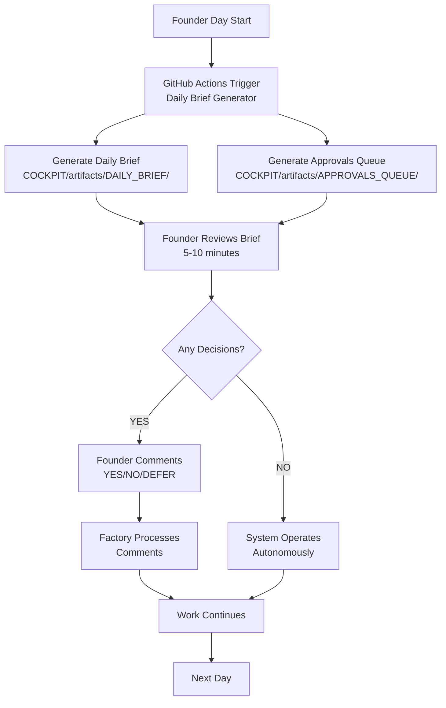
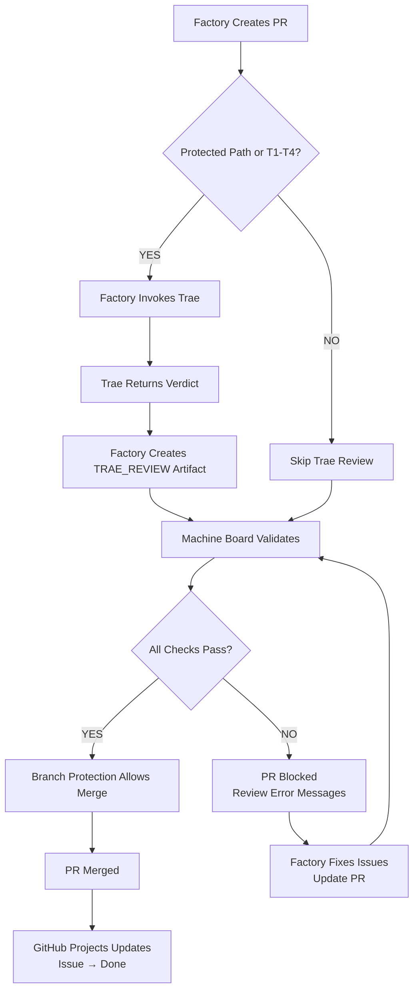
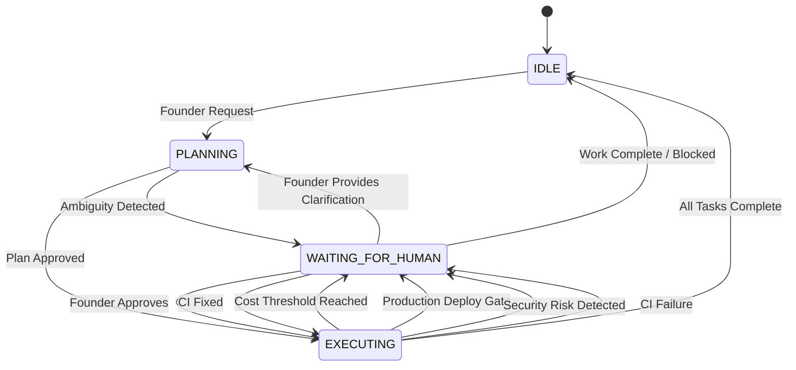

# System Architecture — The Autonomous Engineering OS

Version: v1.0
Owner: Antigravity (CTO)
Ratified By: Founder
Status: CANONICAL

---

## 1. Purpose

This document defines the system architecture of the Autonomous Engineering OS (AE-OS). It explains how all components work together to form a self-governing, self-documenting AI engineering organization.

**Key Principle**: Every action must be provable, reviewed, and resumable.

---

## 2. What is SSOT Here?

The Single Source of Truth (SSOT) for AE-OS is the **Git repository** itself:

- **GitHub** = Canonical system of record
- **STATE/** = Current operational state
- **COCKPIT/artifacts/** = Evidence of all decisions and actions
- **FRAMEWORK/** = Governing rules and requirements
- **FOUNDATION/** = Company constitution
- **PRs + Commits** = Immutable audit trail

No external systems (Notion, Jira, Linear, databases) are SSOT. Everything important exists in Git.

---

## 3. Core Architectural Principles

### 3.1 One-Writer Rule

Only **Factory** writes to the repository. External AIs (ChatGPT, Claude, etc.) operate in **advisors-only** mode.

- **Factory** = Write access ( autonomous execution )
- **External AIs** = Read-only advisory ( no write access )

This prevents divergent paths and ensures all traceability.

### 3.2 Governance-First

Every action flows through governance gates before execution:

```
Request → Vision Check → Risk Assessment → Approval (if required) → Execution → Evidence → State Update
```

Nothing bypasses governance. Nothing executes without traceability.

### 3.3 Deterministic State Machine

The system operates as a deterministic state machine:

```
IDLE → PLANNING → EXECUTING → WAITING_FOR_HUMAN → IDLE
```

At every state transition, the system produces evidence and updates STATE/.

### 3.4 Separation of Concerns

```
Antigravity (Brain)  → Plans, never writes
Factory (Hands)      → Executes, never directs
Trae (Regulator)     → Reviews, never writes, can veto
Machine Board (Audit) → Validates, gates merge
```

Each component has a single, well-defined responsibility.

---

## 4. System Components

### 4.1 Antigravity — The AI CTO

**Role**: Brain of the company. Plans all work, controls execution, never writes code.

**Responsibilities**:
- Load FOUNDATION/01_VISION.md (mandatory startup)
- Translate founder intent into actionable plans
- Create PLAN artifacts in COCKPIT/artifacts/
- Read COCKPIT/artifacts/ for context
- Read COCKPIT/artifacts/DAILY_BRIEF/ and APPROVALS_QUEUE/
- Direct Factory droids to execute
- Never write code directly

**Inputs**:
- Founder requests (natural language)
- FOUNDATION/01_VISION.md (Company Constitution)
- STATE/STATUS_LEDGER.md (current state)
- COCKPIT/artifacts/ (evidence and context)

**Outputs**:
- PLAN artifacts (COCKPIT/artifacts/PLAN-*.md)
- Strategic decisions
- Task assignments to Factory droids

**Verification**:
- Check COCKPIT/artifacts/PLAN-* for recent artifacts
- Check Antigravity loaded FOUNDATION/01_VISION.md (see RUNBOOKS/antigravity-setup.md)

---

### 4.2 Factory — The AI Engineering Org

**Role**: Hands of the company. Executes plans, writes all code, produces all artifacts, never self-directs.

**Responsibilities**:
- Execute plans from Antigravity
- Write application code (APP/)
- Write tests
- Create artifacts (PLAN, EXECUTION, VERIFICATION, RELEASE, INCIDENT)
- Update STATE/ files
- Never plan without Antigravity direction

**Droids (Specialized Agents)**:
- **Product Droid Requirements → backlog items
- **Code Droid**: Implementation → code changes
- **DevOps Droid**: Infrastructure → CI/CD configs
- **QA Droid**: Quality → tests, validation
- **Security Droid**: Security → security checks
- **Knowledge Droid**: Documentation → docs, decisions

**Inputs**:
- PLAN artifacts from Antigravity
- Foundational knowledge (FOUNDATION/, FRAMEWORK_KNOWLEDGE/)
- Current state (STATE/)

**Outputs**:
- Code changes (PRs)
- Artifacts (COCKPIT/artifacts/*)
- State updates (STATE/)

**Verification**:
- Check recent commits and PRs
- Check COCKPIT/artifacts/ for execution evidence
- Check State ledger updated

---

### 4.3 Trae — The External Auditor

**Role**: Independent board & regulator. Reviews plans and PRs, read-only, can veto, never writes.

**Responsibilities**:
- Review all T1-T4 PRs for security and policy compliance
- Check alignment with FOUNDATION/01_VISION.md
- Return verdicts (APPROVE/REJECT/REQUEST_CHANGES)
- NEVER write to repository

**Inputs**:
- PR context (diff, metadata)
- FOUNDATION/01_VISION.md (Company Constitution)
- GOVERNANCE/ policies

**Outputs**:
- Review verdicts
- Security findings
- Policy violations
- Recommendations

**Verification**:
- Check TRAE_REVIEW artifacts in COCKPIT/artifacts/TRAE_REVIEW/
- Check trae-review-validator.yml workflow passes
- See RUNBOOKS/trae-review.md for protocol

---

### 4.4 Machine Board — Automated Governance

**Role**: Automated governance enforcement via CI. Validates all PRs before merge.

**Responsibilities**:
- Run on every PR via .github/workflows/machine-board.yml
- Validate governance rules (secrets, protected paths, risk tiers)
- Validate Trae review artifacts (for T1-T4 PRs)
- Block merge if any check fails
- Zero human approvals required (Trae replaces humans for T1-T2)

**Inputs**:
- PR files and metadata
- Governance rules (GOVERNANCE/)
- Trae review artifacts (COCKPIT/artifacts/TRAE_REVIEW/)

**Outputs**:
- PASS/FAIL status on PR
- Error messages for failures
- CI status check on GitHub

**Verification**:
- Check .github/workflows/machine-board.yml
- Check recent PR CI status
- See FRAMEWORK/PROGRESS.md §Machine Board Governance

---

### 4.5 GitHub Projects — SDLC Board

**Role**: Live SDLC workflow visualization. Tracks all work from backlog to done.

**Responsibilities**:
- Display issue status (Backlog → Planned → In Progress → In Review → Done)
- Track risk tiers and owners
- Link issues to PRs
- Provide founder view of progress

**Inputs**:
- GitHub Issues and PRs (via GraphQL API automation)
- Labels and custom fields (Type, Risk Tier, Owner, Release)

**Outputs**:
- Kanban board visualization
- Project status views
- Daily brief context

**Verification**:
- Check GitHub Projects board at https://github.com/users/ranjan-expatready/projects/2
- See GITHUB_PROJECT_SDLC_ARTIFACT.md

---

### 4.6 Daily Brief + Approvals Queue — Founder Cockpit

**Role**: Founder's daily 5-10 minute board member view. Reduces cognitive load.

**Responsibilities**:
- Auto-generated daily summary of system state
- Explicit YES/NO/DEFER decisions queue
- Trae review requirements tracking
- Blocked items surface

**Inputs**:
- GitHub API (issues, PRs, workflows)
- STATE/STATUS_LEDGER.md
- SDLC Project board

**Outputs**:
- COCKPIT/artifacts/DAILY_BRIEF/BRIEF-YYYYMMDD.md
- COCKPIT/artifacts/APPROVALS_QUEUE/APPROVALS-YYYYMMDD.md
- PR with artifact links

**Verification**:
- Check .github/workflows/daily-brief.yml
- Check recent COCKPIT/artifacts/DAILY_BRIEF/ files
- See scripts/generate_daily_brief.py

---

## 5. How the System Runs

### 5.1 Daily Loop



**What's Automated**:
- Daily brief generation (every 09:00 UTC + manual trigger)
- Approvals queue generation
- Factory processes founder decisions via PR comments

**What Requires Human**:
- Founder reviews daily brief and approves/defers
- Founder authorizes Trae review (for T1-T4 PRs)
- Founder blocks/resumes work at governance gates

---

### 5.2 PR Workflow



**Key Points**:
- Trae review required for protected paths (GOVERNANCE/, AGENTS/, COCKPIT/, .github/workflows/, STATE/)
- Trae review required for T1-T2 risk tiers
- Machine Board enforces all governance rules
- Zero human approvals (Trae replaces humans for T1-T2)

---

### 5.3 State Machine Flow



**Explicit Stop Gates**:
- GATE-1: Entry (ambiguity check)
- GATE-2: Cost (budget threshold)
- GATE-3: Production deployment
- GATE-7: External API changes
- GATE-8: CI/CD validation

See GOVERNANCE/GUARDRAILS.md for detailed gate definitions.

---

### 5.4 Artifact Flow

```mermaid
flowchart LR
    A[Founder Request] --> B[Antigravity]
    B --> C[PLAN Artifact<br/>COCKPIT/artifacts/PLAN/]
    C --> D[Factory Droids]
    D --> E[EXECUTION Artifact<br/>COCKPIT/artifacts/EXECUTION/]
    E --> F[Reliability Agent]
    F --> G[VERIFICATION Artifact<br/>COCKPIT/artifacts/VERIFICATION/]
    G --> H[Trae<br/>if T1-T4]
    H --> I[TRAE_REVIEW Artifact<br/>COCKPIT/artifacts/TRAE_REVIEW/]
    I --> J[Machine Board]
    J --> K{Merge?}
    K -->|YES| L[PR Merged]
    K -->|NO| M[Factory Fixes]
    L --> N[RELEASE Artifact<br/>COCKPIT/artifacts/RELEASE/]
    N --> O[STATE Updated<br/>STATUS_LEDGER.md]
```



**Artifact Types**:
- **PLAN**: Proposed work with risk assessment
- **EXECUTION**: Work performed, evidence of actions
- **VERIFICATION**: Quality checks, test results
- **TRAE_REVIEW**: External security/policy review
- **RELEASE**: Production deployment evidence
- **INCIDENT**: Failure analysis and resolution

All artifacts live in COCKPIT/artifacts/ and are indexed in COCKPIT/ARTIFACT_INDEX.md.

---

## 6. What is Automated vs Requires Founder Decision?

### 6.1 Fully Automated (No Human Required)

| Task | Automation | Trigger |
|------|-----------|---------|
| Daily brief generation | Python script + GitHub Actions | 09:00 UTC daily + manual |
| Approvals queue generation | Python script + GitHub Actions | Same as daily brief |
| Trae review invocation | Factory detects T1-T4 PR | PR opened/synced |
| Machine Board validation | GitHub Actions workflow | Every PR |
| GitHub Projects updates | Automation rules (web UI config) | Issue/PR events |
| CI/CD execution | GitHub Actions workflows | Push/PR events |
| State ledger updates | Factory droids | After every state change |

### 6.2 Requires Founder Decision (YES/NO/DEFER)

| Decision Type | Context | Trigger |
|---------------|---------|---------|
| Trae review authorization | T1-T4 PR needs external review | Approvals Queue |
| Production deployment | T1 risk tier requires explicit auth | Approvals Queue |
| Budget approval | Cost threshold exceeded | Approvals Queue |
| Strategy changes | Major product pivots | Direct conversation with Founder |
| Emergency override | Trae unavailable, critical fix | Direct comment on PR |

**Founder's Daily Workflow** (5-10 minutes):
1. Review generated Daily Brief
2. Review Approvals Queue
3. Make explicit YES/NO/DEFER decisions
4. System operates autonomously if decisions=0

---

## 7. How to Verify

### 7.1 Verification Commands

```bash
# Check system components
echo "=== FOUNDATION ==="
ls -la FOUNDATION/01_VISION.md

echo "=== COCKPIT ==="
ls -la COCKPIT/artifacts/

echo "=== GOVERNANCE ==="
ls -la GOVERNANCE/

echo "=== AGENTS ==="
ls -la AGENTS/

echo "=== STATE ==="
cat STATE/STATUS_LEDGER.md

echo "=== FRAMEWORK ==="
cat FRAMEWORK/PROGRESS.md

echo "=== CI Workflows ==="
ls -la .github/workflows/

echo "=== GitHub Projects ==="
gh project view 2
```

### 7.2 Verification Links

| Component | Verification |
|-----------|-------------|
| FOUNDATION/01_VISION.md | Canonical Company Constitution |
| STATE/STATUS_LEDGER.md | Current operational state |
| FRAMEWORK/PROGRESS.md | Framework progress tracking |
| GitHub Projects Board | https://github.com/users/ranjan-expatready/projects/2 |
| Daily Brief Generator | .github/workflows/daily-brief.yml |
| Machine Board | .github/workflows/machine-board.yml |
| Trae Review | COCKPIT/artifacts/TRAE_REVIEW/ |

---

## 8. Common Failure Modes + What to Do

### 8.1 Machine Board Fails on PR

**Symptoms**: PR check `machine-board` fails

**Root Causes**:
- Secret detected in code (password, API key, token)
- Protected path changed without required artifact
- Risk tier T1/T2 without Trae review artifact
- Trae review artifact missing or verdict != APPROVE

**What to Do**:
1. Read error message from workflow logs
2. If secret: Remove secret, add to secrets manager
3. If missing artifact: Factory creates required artifact
4. If Trae review needed: Factory invokes Trae, create artifact
5. Re-run workflow or push new commit

---

### 8.2 Trae Service Unavailable

**Symptoms**: Trae review invocation times out or returns error

**Root Causes**:
- Trae service down or overloaded
- Network connectivity issues
- API endpoint changed

**What to Do**:
1. Check Trae service status page
2. If critical PR: Use emergency override (see RUNBOOKS/trae-review.md)
3. If non-critical: Wait for service restoration
4. Create post-merge review requirement

---

### 8.3 Daily Brief Generation Fails

**Symptoms**: .github/workflows/daily-brief.yml fails

**Root Causes**:
- GitHub API rate limit exceeded
- Authentication token invalid
- Script error (Python exception)

**What to Do**:
1. Check workflow logs for error details
2. If rate limit: Wait or use different token
3. If auth error: Verify DAILY_BRIEF_TOKEN secret
4. If script error: Check generate_daily_brief.py logs

---

### 8.4 State Ledger Inconsistent

**Symptoms**: STATE/STATUS_LEDGER.md doesn't match GitHub reality

**Root Causes**:
- Factory missed state update
- Manual edits to state files
- Resume protocol failed

**What to Do**:
1. Run resume protocol: /resume command on any issue/PR
2. Factory will reconstruct state from GitHub + artifacts
3. Verify state matches reality
4. If still inconsistent: Check STATE/LAST_KNOWN_STATE.md

---

### 8.5 Antigravity Vision Misalignment

**Symptoms**: Antigravity cannot plan due to error "Vision not loaded"

**Root Causes**:
- FOUNDATION/01_VISION.md missing or not canonical
- Antigravity startup protocol not executed
- Vision document format changed

**What to Do**:
1. Verify FOUNDATION/01_VISION.md exists and has "Status: CANONICAL"
2. Re-run Antigravity startup sequence (see RUNBOOKS/antigravity-setup.md)
3. Ensure Vision document format matches expected structure

---

## 9. "How the Company Runs" End-to-End

### 9.1 Morning (Founder Day Start)

1. **Daily Brief Auto-Generated** (09:00 UTC)
   - GitHub Actions triggers .github/workflows/daily-brief.yml
   - Generates COCKPIT/artifacts/DAILY_BRIEF/BRIEF-YYYYMMDD.md
   - Generates COCKPIT/artifacts/APPROVALS_QUEUE/APPROVALS-YYYYMMDD.md
   - Creates PR with artifact links

2. **Founder Reviews** (5-10 minutes)
   - Opens Daily Brief artifact
   - Reviews Approvals Queue
   - Makes explicit YES/NO/DEFER decisions

3. **Factory Processes Decisions**
   - Monitors PR comments
   - Processes /approve, /reject: [reason], /defer commands
   - Updates approvals queue

4. **Work Continues** (if no blockers)
   - System operates autonomously
   - Factory executes planned work
   - Antigravity generates new plans as needed

---

### 9.2 During Day (Autonomous)

1. **Factory Executes Plans**
   - Antigravity creates PLAN artifacts
   - Factory droids implement
   - PRs created, CI runs

2. **Trae Reviews** (if T1-T4)
   - Factory detects T1-T4 PR
   - Invokes Trae external reviewer
   - Creates TRAE_REVIEW artifact

3. **Machine Board Validates**
   - Every PR runs machine-board workflow
   - Validates governance rules
   - Trae review artifact checked

4. **GitHub Projects Updates**
   - Automation rules move issues/PRs
   - Kanban board reflects live state
   - Founder can view at any time

---

### 9.3 End of Day

1. **Founder Checks Progress**
   - Reviews GitHub Projects board
   - Reviews COCKPIT/artifacts/ for completed work
   - Reviews COCKPIT/logs/ for any issues

2. **System Continues**
   - Background processes run
   - Next day's brief prepared
   - State ledger updated

3. **No Manual GitHub Navigation Required**
   - Everything accessible via Daily Brief + Approvals Queue
   - Cockpit provides single-panel view
   - Founder operates as board member, not engineer

---

## 10. Architecture Trade-Offs

### 10.1 Why GitHub + No External PM System?

**Rationale**:
- Single system of truth (SSOT) in Git
- No tool fragmentation
- GitHub native (no integration complexity)
- Free and reliable

**Trade-Off**:
- Less feature-rich than Jira/Linear
- Requires GitHub Projects automation (manual web UI config)

**Decision**: Simplicity and SSOT > feature richness

---

### 10.2 Why Trae External vs Internal Review?

**Rationale**:
- Independent regulator (no bias)
- Can't be bypassed or influenced
- Read-only (zero write access)
- Enforced by Machine Board, not trust

**Trade-Off**:
- External dependency (Trae service must be available)
- Slightly slower than internal bot

**Decision**: Security and independence > speed

---

### 10.3 Why 6 Specialized Droids vs Single AI?

**Rationale**:
- Separation of concerns (like human teams)
- Expert specialization (Product vs Code vs Security)
- Clear hand-offs and interfaces
- Easier to debug and improve

**Trade-Off**:
- More complex coordination
- Requires inter-agent protocols

**Decision**: Specialization enables scale > simplicity

---

## Version History

- v1.0 (2026-01-26): Initial System Architecture document

---

**Document Version**: v1.0
**Last Updated**: 2026-01-26 by Knowledge Droid
**Status**: CANONICAL
