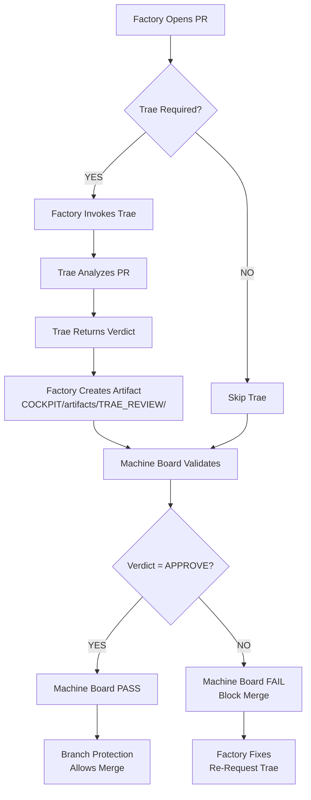
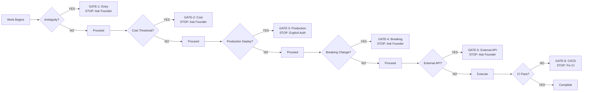

# Governance Model — Risk Tiers, Controls, and Enforcement

Version: v1.0
Owner: Antigravity (CTO)
Ratified By: Founder
Status: CANONICAL

---

## 1. Purpose

This document defines the governance model of the Autonomous Engineering OS. It explains the risk tier classification system (T0-T4), required controls, branch protection settings, Machine Board enforcement, Trae integration, and emergency override protocol.

**Key Principle**: Governance is enforced automatically, not by trust.

---

## 2. What is SSOT Here?

The Single Source of Truth for governance is:

- **GOVERNANCE/RISK_TIERS.md** — Risk tier definitions and approval requirements
- **GOVERNANCE/GUARDRAILS.md** — One-writer rule, approval gates, safe terminal
- **GOVERNANCE/COST_POLICY.md** — Budget tracking and thresholds
- **GOVERNANCE/DEFINITION_OF_DONE.md** — When work is complete
- **GOVERNANCE/QUALITY_GATES.md** — Quality gates by system maturity stage
- **.github/workflows/machine-board.yml** — Automated governance enforcement
- **COCKPIT/artifacts/TRAE_REVIEW/** — Trae review evidence

No external systems control governance. All rules are version-controlled and immutable.

---

## 3. Risk Tiers (T0-T4)

### 3.1 Risk Tier Matrix

| Tier | Name | Autonomy Level | Human Approval | Trae Review | Examples |
|------|------|----------------|----------------|-------------|----------|
| T0 | Informational | Full | Never | No | Reading files, viewing logs, generating reports |
| T3 | Low | High | Never for Dev Fast Mode | No | Formatting, adding docs, small refactors |
| T2 | High | Limited | Yes (1 reviewer) | Yes | Database migrations, breaking API changes |
| T1 | Critical | None | Explicit authorization | Yes | Production deploy, security, payments |

### 3.2 Risk Tier Definitions

#### T0 (Informational)

**Definition**: Read-only operations that cannot affect system state

**Characteristics**:
- No writes to system
- No irreversible actions
- Zero cost impact

**Examples**:
- Reading files
- Viewing logs
- Analyzing code patterns
- Generating reports
- Reviewing test results

**Required Controls**: None (fully autonomous)

#### T3 (Low Risk)

**Definition**: Operations that are reversible, have clear rollback paths, and minimal blast radius

**Characteristics**:
- Reversible actions
- Local scope (non-critical paths)
- No customer-facing impact
- Can be undone easily

**Examples**:
- Formatting and linting fixes
- Adding comments or documentation
- Small refactorings with test coverage
- Creating new feature branches
- Updating README files

**Required Controls**:
- Tests must pass (if applicable)
- No regression in existing functionality
- Documentation updated (if user-facing)

#### T2 (High Risk)

**Definition**: Operations with broader impact, requiring careful consideration and explicit approvals

**Characteristics**:
- Harder to reverse
- Broader blast radius
- May affect customers
- Cost considerations

**Examples**:
- Database schema migrations
- Breaking API changes
- Major dependency upgrades
- Cloud resource scaling (significant)
- New API integrations

**Required Controls**:
- Human approval (1 reviewer minimum)
- Rollback plan documented and tested
- Impact assessment completed
- Tests passing (including integration tests)
- Staging deployment verified
- Trae review required (external mandatory)

#### T1 (Critical)

**Definition**: Operations with significant potential for harm, requiring explicit human authorization

**Characteristics**:
- Irreversible or hard to reverse
- Direct customer impact
- Security implications
- Financial impact
- Reputation risk

**Examples**:
- Production deployment
- Production infrastructure changes
- Authentication/authorization system changes
- Payment processing changes
- Production data deletion
- SSL certificate management
- Compliance-related code changes

**Required Controls**:
- Explicit human authorization before execution
- Production rollback plan tested and ready
- Incident response plan documented
- Security review completed
- Post-deployment verification plan
- Trae review required (external mandatory)

---

## 4. Branch Protection Settings

### 4.1 Default Branch: `main`

Protection rules enforced via GitHub API:

```json
{
  "required_status_checks": {
    "strict": true,
    "contexts": ["machine-board", "trae-review"]
  },
  "enforce_admins": true,
  "allow_force_pushes": false,
  "allow_deletions": false,
  "required_pull_request_reviews": {
    "dismiss_stale_reviews": true,
    "require_code_owner_reviews": false,
    "required_approving_review_count": 0
  },
  "restrictions": null
}
```

### 4.2 Protection Rule Breakdown

| Setting | Value | Rationale |
|---------|-------|-----------|
| **Require PR before merging** | Enabled | No direct pushes to main |
| **Required status checks** | machine-board, trae-review | Enforce automated governance |
| **Strict mode** | Enabled | Require checks on every PR, not just target branch |
| **Enforce on admins** | Enabled | No bypass even for repo owner |
| **Require code owner reviews** | 0 | Trae replaces human approval for T1-T2 |
| **Allow force push** | Disabled | Prevent history destruction |
| **Allow deletions** | Disabled | Prevent branch deletion |
| **Dismiss stale reviews** | Enabled | Require fresh reviews on updates |

### 4.3 How to Verify Branch Protection

```bash
# Check branch protection settings
gh api repos/ranjan-expatready/autonomous-engineering-os/branches/main/protection

# Expected output should show:
# - required_status_checks.contexts includes "machine-board" and "trae-review"
# - enforce_admins is true
# - allow_force_pushes is false
# - allow_deletions is false
```

---

## 5. Machine Board Enforcement

### 5.1 What is the Machine Board?

The Machine Board is an automated governance system that validates every PR before merge. It replaces human approval with deterministic rule enforcement.

**Mode**: Board of Directors (no human approvals)

**Enforcement Method**: GitHub Actions workflow (.github/workflows/machine-board.yml)

### 5.2 Machine Board Validation Checks

The machine-board.yml workflow runs these checks on every PR:

```python
# Pseudocode: Machine Board validation
def machine_board_checks(pr):
    checks = []

    # Check 1: Secret Detection
    if detect_secrets(pr.diff):
        checks.append("FAIL: Secret detected (password, API key, token)")

    # Check 2: Protected Path Artifacts
    for path in pr.changed_files:
        if path in protected_paths:
            if not has_required_artifact(path, pr):
                checks.append(f"FAIL: Missing artifact for protected path: {path}")

    # Check 3: STATE File Updates
    if pr.touching_app_code() and not pr.updates_state():
        checks.append("FAIL: Non-BACKLOG PR must update STATE/ files")

    # Check 4: Risk Tier Requirements
    if is_t1_or_t2(pr):
        if not has_rollback_plan(pr):
            checks.append("FAIL: T1/T2 requires rollback plan documented")
        if not has_verification_plan(pr):
            checks.append("FAIL: T1/T2 requires verification proof")

    # Check 5: Trae Review (for T1-T4)
    if is_t1_t2_t3_t4(pr):
        if not has_trae_review_artifact(pr):
            checks.append("FAIL: T1-T4 PR requires Trae review artifact")
        else:
            trae_verdict = get_trae_verdict(pr)
            if trae_verdict['verdict'] not in ['APPROVE', 'EMERGENCY_OVERRIDE']:
                checks.append(f"FAIL: Trae verdict is '{trae_verdict['verdict']}', require APPROVE")

    # Check 6: Framework Structure
    if not framework_structure_valid():
        checks.append("FAIL: Required framework files missing")

    return checks
```

### 5.3 Validation Outcomes

| Outcome | Condition | Action |
|---------|-----------|--------|
| **PASS** | All checks pass | Branch protection allows merge |
| **FAIL** | Any check fails | Branch protection blocks merge, review error |
| **SKIP** | Push event (not PR) | Gracefully skip, no block on pushes |

### 5.4 Verification

Check recent PR for machine-board status:

```bash
# Get recent PRs
gh pr list --limit 3

# Check machine-board status for a specific PR
gh pr view 42 --json statusCheckRollup
```

See FRAMEWORK/PROGRESS.md §Machine Board Governance for validation evidence.

---

## 6. Trae Enforcement

### 6.1 What is Trae?

Trae is the mandatory external security and policy reviewer for all T1-T4 PRs.

**Characteristics**:
- **Read-only**: Zero write access, advisory-only
- **Independent**: Cannot be bypassed or influenced by Factory
- **Enforced**: Machine Board validates Trae review artifacts
- **Vision-Aligned**: Checks alignment with FOUNDATION/01_VISION.md

### 6.2 When Trae Review is Required

Trae review is **mandatory** when ANY of these conditions are met:

1. **Protected Path Changed**:
   - GOVERNANCE/**
   - AGENTS/**
   - COCKPIT/**
   - .github/workflows/**
   - STATE/**

2. **T1 or T2 Risk Tier**:
   - PR labeled `tier-1` or `critical`
   - PR labeled `tier-2` or `high-risk`

3. **Machine Board Flags**:
   - Governance validator flags Trae check required

### 6.3 Trae Review Flow



### 6.4 Trae Verdicts

| Verdict | Meaning | Action |
|---------|---------|--------|
| **APPROVE** | No issues, safe to merge | Machine Board allows merge |
| **REJECT** | Critical issues found | Machine Board blocks merge |
| **REQUEST_CHANGES** | Minor issues, should address | Log warning, can still merge |
| **EMERGENCY_OVERRIDE** | Trae unavailable, critical fix | Machine Board allows with post-merge review |
| **ERROR** | Trae service error | Use emergency override if critical |

### 6.5 Trae Vision Alignment Check

Trae **MUST** check alignment with FOUNDATION/01_VISION.md:

| VISION_ALIGNMENT | Verdict | Result |
|------------------|---------|--------|
| **YES** | APPROVE | ✅ Merge allowed |
| **YES** | REJECT | ❌ Blocked (other issues) |
| **CONCERNS** | APPROVE | ⚠️ Merge with warning |
| **CONCERNS** | REJECT | ❌ Blocked |
| **NO** | ANY | ❌ BLOCKED (Vision conflict) |

### 6.6 Trae Review Artifact Format

Location: `COCKPIT/artifacts/TRAE_REVIEW/TRAE-{YYYYMMDD}-{PR-NUMBER}.yml`

```yaml
ARTIFACT_TYPE: TRAE_REVIEW
artifact_id: "TRAE-20260125-042"
created_at: "2026-01-25 14:30 UTC"
created_by: "Factory (based on Trae verdict)"

pr_number: 42
pr_url: "https://github.com/owner/repo/pull/42"

# TRAE'S VERDICT
verdict: "APPROVE"
signature: "trae-external-reviewer"

# VISION ALIGNMENT CHECK
vision_alignment: "YES"
vision_concerns: []

review_scope:
  - "GOVERNANCE/GUARDRAILS.md"
  - "scripts/governance_validator.py"

security_findings: []

policy_violations: []

# RECOMMENDATIONS
recommendations: |
  No security or policy issues found. Change is compliant with governance
  policies and aligns with FOUNDATION/01_VISION.md.
  Vision Alignment: YES - Change aligns with Company Constitution.

# METADATA
review_timestamp: "2026-01-25T14:30:00Z"
expiry_days: 7

links:
  github_pr: "https://github.com/owner/repo/pull/42"
  artifact_file: "COCKPIT/artifacts/TRAE_REVIEW/TRAE-20260125-042.yml"
  vision_document: "FOUNDATION/01_VISION.md"
```

### 6.7 Artifact Expiry

Trae review artifacts are valid for **7 days**. After 7 days, Machine Board fails validation and re-review is required.

**Revalidation on PR Update**:
When a PR gets a new commit, Factory must re-send to Trae, get new verdict, and update artifact.

---

## 7. Emergency Override Protocol

### 7.1 When to Use Emergency Override

Emergency override should only be used when:

1. **Trae Service Unavailable**:
   - Trae API timeout
   - Trae service down
   - Network connectivity issues

2. **Critical Security Fix**:
   - Production vulnerability requiring immediate patch
   - Time-sensitive security incident response

### 7.2 Emergency Override Process

**Step 1: Declare Emergency in PR Description**

```markdown
## EMERGENCY OVERRIDE
- Reason: Trae service unavailable, critical security fix needed
- Authorized by: @username
- Post-merge review required: true
```

**Step 2: Factory Creates Emergency Override Artifact**

```yaml
verdict: "EMERGENCY_OVERRIDE"
emergency_reason: "Trae service unavailable, critical security fix needed"
authorized_by: "@username"
post_merge_review_required: true
```

**Step 3: Machine Board Allows Merge**

Machine Board validates emergency override flag and allows merge.

**Step 4: Post-Merge Review Required**

When Trae service is restored:
1. Factory re-invokes Trae for production PR
2. Trae reviews the merged change
3. Create post-merge review artifact
4. If Trae finds issues, create INCIDENT artifact

### 7.3 Emergency Override Checklist

- [ ] Document emergency reason in PR
- [ ] Get founder authorization (comment on PR or approve via Approvals Queue)
- [ ] Create EMERGENCY_OVERRIDE artifact
- [ ] Post-merge review required: yes/no
- [ ] Rollback plan documented (if needed)
- [ ] Notify stakeholders (if applicable)

See RUNBOOKS/trae-review.md for detailed protocol.

---

## 8. What's Allowed vs Blocked

### 8.1 Allowed (Can Merge Without Human Approval)

| Change | Context | Reason |
|--------|---------|--------|
| Formatting fixes | APP/, BACKLOG/, FRAMEWORK_KNOWLEDGE/ | Dev Fast Mode enabled |
| Documentation updates | Non-governance paths | T3 risk, CI passes |
| Bug fixes | APP/ | T3 risk if non-production |
| Feature development | APP/, PRODUCT/ | Dev Fast Mode enabled |
| Staging deployment | PR with CI pass | T3 risk, staging auto-merge |

### 8.2 Blocked (Requires Trae Review)

| Change | Context | Reason |
|--------|---------|--------|
| Governance changes | GOVERNANCE/ | Protected path, T2+ risk |
| Agent behavior changes | AGENTS/ | Protected path, T2+ risk |
| Workflow changes | .github/workflows/ | Protected path, T2+ risk |
| State changes | STATE/ | Protected path, T2+ risk |
| Cockpit changes | COCKPIT/ | Protected path, T2+ risk |
| Production deployment | Any T1 change | T1 risk, critical |

### 8.3 Blocked (Requires Explicit Founder Authorization)

| Change | Context | Reason |
|--------|---------|--------|
| Production deployment | T1 risk tier | Critical, irreversible |
| Security credential use | Production secrets | Security risk |
| Payment processing changes | Financial code | Compliance risk |
| Compliance changes | PCI/GDPR code | Regulatory risk |
| Major product pivot | Strategic change | Business risk |
| Budget threshold exceed | Cost policy violation | Financial risk |

---

## 9. Approval Gates (When System Stops)

### 9.1 Explicit Stop Gates

The system stops and waits for human decision at these gates:



### 9.2 Gate Definitions

| Gate | Name | Trigger | Action |
|------|------|---------|--------|
| **GATE-1** | Entry | Ambiguity detected | Ask Founder for clarification |
| **GATE-2** | Cost | Budget threshold exceeded | Ask for budget approval |
| **GATE-3** | Production | T1 production deployment | Require explicit authorization |
| **GATE-4** | Breaking | Breaking API/db change | Ask for approval |
| **GATE-5** | External API | New external integration | Ask for approval |
| **GATE-8** | CI/CD | CI checks fail | Fix before proceed |

See GOVERNANCE/GUARDRAILS.md for detailed gate definitions.

---

## 10. Cost Policy and Thresholds

### 10.1 Cost Tracking System

**Location**: GOVERNANCE/COST_POLICY.md, STATE/STATUS_LEDGER.md

**Components**:
- Budget limits (daily, weekly, monthly)
- Actual spend tracking
- Alert thresholds
- Approval gates for threshold exceeded

### 10.2 Cost Thresholds

| Threshold | Value | Action |
|-----------|-------|--------|
| **Daily Alert** | 80% of daily budget | Log warning |
| **Daily Stop** | 100% of daily budget | GATE-2: Stop and ask |
| **Weekly Alert** | 80% of weekly budget | Log warning |
| **Weekly Stop** | 100% of weekly budget | GATE-2: Stop and ask |

### 10.3 Verification

```bash
# Check cost policy
cat GOVERNANCE/COST_POLICY.md

# Check current spend
cat STATE/STATUS_LEDGER.md | grep -A 20 "Cost Tracking"
```

---

## 11. Definition of Done

### 11.1 When Work is Complete

Work is complete when all Definition of Done (DoD) criteria are met.

**Location**: GOVERNANCE/DEFINITION_OF_DONE.md

**DoD Criteria**:
- Tests passing (unit + integration)
- Code reviewed (Trae for T1-T4)
- Documentation updated
- Artifacts created (PLAN, EXECUTION, VERIFICATION, TRAE_REVIEW)
- State updated (STATUS_LEDGER.md)
- No open blockers
- CI checks passing

### 11.2 Quality Gates

Quality gates increase as system matures:

| Stage | Coverage Required | Security | Performance |
|-------|-------------------|----------|-------------|
| **Stage 0** (Init) | N/A (no code coverage floor) | PASS | PASS |
| **Stage 1** (MVP) | 70% coverage floor | PASS | PASS |
| **Stage 2** (Growth) | 80% coverage floor | PASS | PASS |
| **Stage 3** (Scale) | 90% coverage floor | PASS | PASS |

See GOVERNANCE/QUALITY_GATES.md for details.

---

## 12. What is Automated vs Requires Founder Decision?

### 12.1 Fully Automated (No Human Required)

| Task | Automation | Trigger |
|------|-----------|---------|
| Machine Board validation | GitHub Actions workflow | Every PR |
| Trae review invocation | Factory detects T1-T4 PR | PR opened/synced |
| Trae artifact validation | machine-board.yml | Every PR |
| Secret detection | machine-board.yml | Every PR |
| Protected path validation | machine-board.yml | Every PR |
| Risk tier enforcement | machine-board.yml | Every PR |
| CI/CD validation | ci.yml workflow | Every PR |

### 12.2 Requires Founder Decision (YES/NO/DEFER)

| Decision Type | Context | Trigger |
|---------------|---------|---------|
| Production deployment | T1 risk tier | Approvals Queue |
| Budget approval | Cost threshold exceeded | Approvals Queue |
| Strategy change | Major product pivot | Direct conversation |
| Emergency override | Trae unavailable, critical fix | Comment on PR |
| Founder auth | Explicit authorization required | Direct comment or Approvals Queue |

---

## 13. How to Verify

### 13.1 Verification Commands

```bash
# Check governance files
echo "=== GOVERNANCE ==="
ls -la GOVERNANCE/

echo "=== Check branch protection ==="
gh api repos/ranjan-expatready/autonomous-engineering-os/branches/main/protection

echo "=== Check recent PRs for machine-board status ==="
gh pr list --limit 3
gh pr view <pr-number> --json statusCheckRollup

echo "=== Check Trae artifacts ==="
ls -la COCKPIT/artifacts/TRAE_REVIEW/

echo "=== Check Machine Board workflow ==="
gh workflow view machine-board

echo "=== Check Trae validator workflow ==="
gh workflow view trae-review-validator
```

### 13.2 Verification Links

| Component | Verification |
|-----------|-------------|
| Machine Board | .github/workflows/machine-board.yml |
| Trae Validator | .github/workflows/trae-review-validator.yml |
| Risk Tiers | GOVERNANCE/RISK_TIERS.md |
| Branch Protection | GitHub repo settings → Branches → main |
| Trae Reviews | COCKPIT/artifacts/TRAE_REVIEW/ |

---

## 14. Common Failure Modes + What to Do

### 14.1 Machine Board Fails on PR

**Symptoms**: `machine-board` check fails on PR

**Common Causes**:
- Secret detected (password, API key, token)
- Protected path changed without required artifact
- T1/T2 risk tier without Trae review artifact
- Trae verdict != APPROVE
- STATE file not updated for non-BACKLOG PR

**What to Do**:
1. Read error message from workflow logs
2. If secret: Remove secret, add to secrets manager
3. If missing artifact: Factory creates required artifact
4. If Trae needed: Factory invokes Trae, create artifact
5. If STATE update needed: Factory updates STATE/ files
6. Re-run workflow or push new commit

### 14.2 Trae Review Fails

**Symptoms**: `trae-review` check fails on PR

**Common Causes**:
- Trae verdict is REJECT or REQUEST_CHANGES
- Trae Vision Alignment is NO
- Trae artifact missing or stale (> 7 days)
- Trae service error

**What to Do**:
1. Review Trae findings in artifact
2. Address security findings or policy violations
3. Fix Vision alignment concerns
4. Re-request Trae review after fixes
5. If Trae unavailable, use emergency override (if critical)

### 14.3 Branch Protection Blocks Merge

**Symptoms**: Cannot merge PR despite all checks passing

**Common Causes**:
- Branch protection misconfigured
- Required status checks missing
- Admin override disabled but trying to bypass

**What to Do**:
1. Check branch protection settings: `gh api repos/.../branches/main/protection`
2. Verify required status checks: machine-board, trae-review
3. Ensure all checks are passing
4. Contact GitHub support if settings incorrect

---

## Version History

- v1.0 (2026-01-26): Initial Governance Model document

---

**Document Version**: v1.0
**Last Updated**: 2026-01-26 by Knowledge Droid
**Status**: CANONICAL
