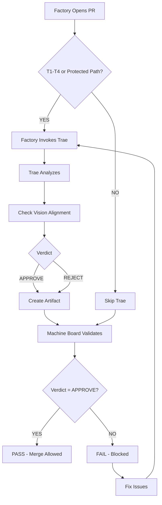

# Trae — The External Auditor

Version: v1.0
Owner: Antigravity (CTO)
Ratified By: Founder
Status: CANONICAL

---

## 1. Purpose

This document defines Trae, the mandatory external auditor of the Autonomous Engineering OS. It explains Trae's role as read-only external security and policy reviewer, its artifact format, validator rules, test evidence, and integration with Machine Board.

**Key Principle**: Trae is independent, read-only, and cannot be bypassed or influenced by Factory.

---

## 2. What is SSOT Here?

The Single Source of Truth for Trae is:

- **AGENTS/TRAE.md** — Trae agent definition, scope, isolation policy
- **COCKPIT/artifacts/TRAE_REVIEW/** — Trae review artifacts (evidence)
- **RUNBOOKS/trae-review.md** — Invocation and protocol for Trae
- **.github/workflows/trae-review-validator.yml** — PR checks
- **scripts/governance_validator.py** — Trae validation code

Trae itself has no repository write access. Trae reviews are advisory-only and enforced via Machine Board.

---

## 3. Trae's Role

### 3.1 The Independent Auditor

Trae is the "independent board & regulator" of Autonomous Engineering OS:

- **Read-only**: Zero write access, advisory-only mode
- **Independent**: Cannot be bypassed or influenced by Factory
- **Enforced**: Machine Board validates artifacts before merge
- **Vision-Aligned**: Checks alignment with FOUNDATION/01_VISION.md

Trae replaces human approval for **T1-T2** risk tier changes.

### 3.2 When Trae Review is Required

Trae review is **MANDATORY** when ANY of these are met:

**Protected Path Changed**: GOVERNANCE/**, AGENTS/**, COCKPIT/**, .github/workflows/**, STATE/**

**T1 or T2 Risk Tier**: PR labeled `tier-1`/`critical` or `tier-2`/`high-risk`

### 3.3 Trae Verdicts

| Verdict | Meaning | Action |
|---------|---------|--------|
| **APPROVE** | No issues | ✅ Merge allowed |
| **REJECT** | Critical issues | ❌ Block merge |
| **REQUEST_CHANGES** | Minor issues | ⚠️ Allowed with warning |
| **EMERGENCY_OVERRIDE** | Trae unavailable, critical fix | ✅ With post-merge review |

### 3.4 Vision Alignment Check

Trae **MUST** check alignment with FOUNDATION/01_VISION.md:

| VISION_ALIGNMENT | Result |
|------------------|--------|
| **YES** | ✅ Proceed |
| **CONCERNS** | ⚠️ Warning |
| **NO** | ❌ BLOCKED |

---

## 4. Trae Review Flow



---

## 5. Trae Review Artifact Format

**Location**: `COCKPIT/artifacts/TRAE_REVIEW/TRAE-{YYYYMMDD}-{PR-NUMBER}.yml`

**Naming**: `TRAE-{YYYYMMDD}-{PR-NUMBER}.yml`

```yaml
ARTIFACT_TYPE: TRAE_REVIEW
artifact_id: "TRAE-20260125-042"
created_at: "2026-01-25 14:30 UTC"
created_by: "Factory (based on Trae verdict)"

pr_number: 42
pr_url: "https://github.com/owner/repo/pull/42"

# TRAE'S VERDICT
verdict: "APPROVE"
signature: "trae-external-reviewer"

# VISION ALIGNMENT
vision_alignment: "YES"
vision_concerns: []

review_scope:
  - "GOVERNANCE/GUARDRAILS.md"
  - "scripts/governance_validator.py"

security_findings: []
policy_violations: []

# RECOMMENDATIONS
recommendations: |
  No security or policy issues found. Aligns with Company Constitution.

review_timestamp: "2026-01-25T14:30:00Z"
expiry_days: 7

links:
  github_pr: "https://github.com/owner/repo/pull/42"
  artifact_file: "COCKPIT/artifacts/TRAE_REVIEW/TRAE-20260125-042.yml"
  vision_document: "FOUNDATION/01_VISION.md"
```

---

## 6. Machine Board Validation

Machine Board validates Trae artifacts:

1. **Find artifact**: `TRAE-*-{PR}.yml`
2. **Validate verdict**: Must be **APPROVE** or **EMERGENCY_OVERRIDE**
3. **Validate Vision**: Must be **YES** or **CONCERNS** (NO blocks merge)
4. **Validate expiry**: Must be < 7 days old

| Check | Pass | Fail |
|-------|------|------|
| Artifact Exists | ✅ | ❌ "No TRAE_REVIEW artifact" |
| Verdict | APPROVE/EMERGENCY_OVERRIDE | ❌ "Require APPROVE" |
| Vision Alignment | YES/CONCERNS | ❌ "Vision conflict" |
| Expiry | < 7 days | ❌ "Stale (> 7 days)" |

---

## 7. Emergency Override

Use when Trae unavailable + critical security fix needed.

**Process**:
1. Declare in PR: `## EMERGENCY OVERRIDE`
2. Factory creates EMERGENCY_OVERRIDE artifact
3. Machine Board allows merge
4. Post-merge Trae review required

---

## 8. Test Evidence

| Test | Purpose | Status | Outcome |
|------|---------|--------|---------|
| Test A | T1 blocked without Trae artifact | ✅ PASS | Blocked correctly |
| Test B | T1 passes with Trae APPROVE | ✅ PASS | Allowed correctly |

See FRAMEWORK/EVIDENCE_INDEX.md for detailed evidence.

---

## 9. How to Verify

```bash
# Check Trae artifacts
ls COCKPIT/artifacts/TRAE_REVIEW/*.yml

# Check validator workflow
gh workflow view trae-review-validator

# Check governance validator
cat scripts/governance_validator.py | grep Trae
```

**Verification Links**: AGENTS/TRAE.md, RUNBOOKS/trae-review.md, FRAMEWORK/EVIDENCE_INDEX.md

---

## 10. What's Automated vs Requires Founder

**Automated**:
- Trae invocation (Factory detects T1-T4)
- Trae artifact creation
- Machine Board validation
- Vision alignment check

**Requires Founder**:
- Emergency override (if Trae unavailable + critical)

---

## 11. Common Failures

| Issue | Symptom | Fix |
|-------|---------|-----|
| **Timeout** | "Trae service timeout" | Retry, split PR, use emergency |
| **REJECT** | "Trae verdict is REJECT" | Fix security/policy issues, re-request |
| **Vision=NO** | "Vision conflict" | Align with FOUNDATION/01_VISION.md |

---

## Version History

- v1.0 (2026-01-26): Initial Trae dossier

---

**Document Version**: v1.0
**Last Updated**: 2026-01-26
**Status**: CANONICAL
