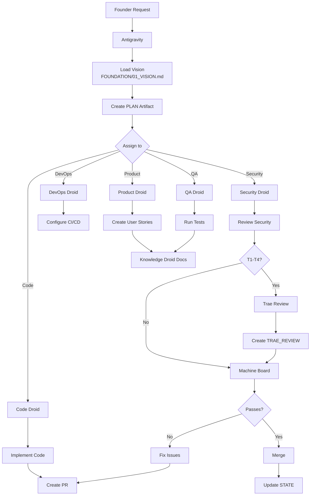

# Factory — The AI Engineering Org

Version: v1.0
Owner: Antigravity (CTO)
Ratified By: Founder
Status: CANONICAL

---

## 1. Purpose

This document defines Factory, the AI engineering organization of Autonomous Engineering OS. It explains the specialized droid roster, who can request issues/PRs, execution rules, and the PR-only workflow.

**Key Principle**: Factory executes, never self-directs.

---

## 2. What is SSOT Here?

The Single Source of Truth for Factory is:

- **AGENTS/ROLES.md** — Agent roles and responsibilities
- **AGENTS/CONTRACTS.md** — Standard contracts for each task type
- **AGENTS/*_DROID_CONTRACT.md** — Individual droid contracts
- **COCKPIT/artifacts/PLAN/** — Antigravity-generated plans
- **STATE/STATUS_LEDGER.md** — Current operational state

No hardcoded behavior. All execution logic is version-controlled.

---

## 3. Factory's Role

### 3.1 The AI Workforce

Factory is the "hands of the company" — the AI engineering organization that:

- **Executes plans**: Implements work per Antigravity direction
- **Writes all code**: Creates PRs, implements features
- **Produces artifacts**: Creates PLAN, EXECUTION, VERIFICATION, RELEASE
- **Never self-directs**: Requires Antigravity direction
- **Respects governance**: Stops at explicit gates, follows risk tiers

Factory includes specialized droids:
- **Product Droid**: Requirements, user stories, backlog
- **Code Droid**: Implementation, code, tests
- **DevOps Droid**: CI/CD, infrastructure, deployments
- **QA Droid**: Testing, validation, quality
- **Security Droid**: Security review, compliance
- **Knowledge Droid**: Documentation, history

### 3.2 One-Writer Rule

**Only Factory writes to the repository.**

- Factory = Write access ✅
- External AIs (ChatGPT, Claude, etc.) = Advisors-only ❌
- Trae = Read-only ❌

This ensures all traceability through one source.

---

## 4. Droid Roster

### 4.1 Product Droid

**Focus**: Requirements, backlog, prioritization

**Responsibilities**:
- Translate founder vision into user stories
- Define acceptance criteria
- Maintain PRODUCT/ directory
- Prioritize backlog items

**Forbidden**:
- ❌ Never writes APP/ code
- ❌ Never deploys
- ❌ Never modifies governance

**Risk Tier**: T3

**Contract**: AGENTS/PRODUCT_DROID_CONTRACT.md

---

### 4.2 Code Droid

**Focus**: Implementation, feature development, bug fixes

**Responsibilities**:
- Implement features per user stories
- Write clean, maintainable code
- Write unit and integration tests
- Follow existing patterns

**Forbidden**:
- ❌ Never deploys to production (T1 requires auth)
- ❌ Never modifies governance
- ❌ Never self-directs

**Risk Tier**: T3/T2

**Contract**: AGENTS/CODE_DROID_CONTRACT.md

---

### 4.3 DevOps Droid

**Focus**: CI/CD, infrastructure, pipelines

**Responsibilities**:
- Create GitHub Actions workflows
- Configure CI/CD pipelines
- Manage infrastructure-as-code
- Monitor build failures

**Forbidden**:
- ❌ Never modifies production directly
- ❌ Never bypasses deployment gates
- ❌ Never changes CI/CD without Security review

**Risk Tier**: T3/T1

**Contract**: AGENTS/DEVOPS_DROID_CONTRACT.md

---

### 4.4 QA Droid

**Focus**: Testing, validation, quality assurance

**Responsibilities**:
- Write and execute test plans
- Add test coverage
- Validate code meets standards
- Identify security issues
- Monitor performance

**Forbidden**:
- ❌ Never bypasses quality gates
- ❌ Never approves production without testing
- ❌ Never modifies code

**Risk Tier**: T3

**Contract**: AGENTS/QA_DROID_CONTRACT.md

---

### 4.5 Security Droid

**Focus**: Security, compliance, safe execution

**Responsibilities**:
- Review code for vulnerabilities
- Check policies compliance
- Validate secrets management
- Recommend security practices

**Forbidden**:
- ❌ Never approves secrets in code
- ❌ Never bypasses security checks
- ❌ Never introduces insecure code

**Risk Tier**: T2

**Contract**: AGENTS/SECURITY_DROID_CONTRACT.md

---

### 4.6 Knowledge Droid

**Focus**: Documentation, memory, history

**Responsibilities**:
- Capture decisions with rationale
- Update runbooks and docs
- Maintain API documentation
- Identify patterns

**Forbidden**:
- ❌ Never deletes decisions
- ❌ Never modifies code
- ❌ Never makes assumptions

**Risk Tier**: T3

**Contract**: AGENTS/KNOWLEDGE_DROID_CONTRACT.md

---

## 5. Who Can Request Issues/PRs?

### 5.1 Authorization Matrix

| Requester | Can Request Issues? | Can Create PRs? | Notes |
|-----------|-------------------|-----------------|-------|
| **Founder** | ✅ Yes | ✅ Yes | Full access |
| **Antigravity** | ✅ Yes | ✅ Yes | Via Factory droids |
| **Product Droid** | ✅ Yes | ❌ No | Product specs only |
| **Code Droid** | ❌ No | ✅ Yes | Implements plans |
| **DevOps Droid** | ❌ No | ✅ Yes | Infra/CI/CD only |
| **QA Droid** | ✅ Yes | ❌ No | Bug reports only |
| **Security Droid** | ✅ Yes | ❌ No | Security issues only |
| **Knowledge Droid** | ❌ No | ❌ No | Docs only |
| **Trae** | ❌ No | ❌ No | Receives PRs, no write |

---

## 6. Execution Flow



---

## 7. PR-Only Workflow

### 7.1 Direct Push Protection

**Direct pushes to `main` are FORBIDDEN.**

| Action | Status |
|--------|--------|
| PR required before merge | ✅ Enabled |
| Require status checks | ✅ machine-board, trae-review |
| Enforce on admins | ✅ Enabled |
| Force push protection | ✅ Enabled |
| Delete protection | ✅ Enabled |

### 7.2 PR Required

All changes must go through Pull Request:

```
Founder → Antigravity → Factory → PR → Machine Board → Merge → Update STATE
```

**No exceptions.**

---

## 8. What's Automated vs Requires Founder

### 8.1 Fully Automated

| Task | Automation | Trigger |
|------|-----------|---------|
| User story creation | Product Droid | Founder request via Antigravity |
| Code implementation | Code Droid | PLAN artifact |
| Test execution | QA Droid | Code changes |
| Documentation updates | Knowledge Droid | Decisions made |
| Machine Board validation | GitHub Actions | Every PR |

### 8.2 Requires Founder Decision

| Decision Type | Context | Trigger |
|---------------|---------|---------|
| Production deployment | T1 risk tier | Approvals Queue |
| Budget approval | Cost threshold | Approvals Queue |
| Strategy change | Major pivot | Direct conversation |
| Emergency override | Trae unavailable | Comment on PR |

---

## 9. How to Verify

```bash
# Check droid contracts
ls AGENTS/*_DROID_CONTRACT.md

# Check recent factory activity
git log --oneline -10

# Check active PRs
gh pr list

# Check STATE
head -30 STATE/STATUS_LEDGER.md
```

**Verification Links**:
- AGENTS/ROLES.md — Agent definitions
- AGENTS/CONTRACTS.md — Standard contracts
- STATE/STATUS_LEDGER.md — Current state

---

## 10. Common Failures

### 10.1 Self-Direction

**Symptom**: Agent implements without Antigravity direction

**Fix**: Verify PLAN artifact exists, ensure Vision alignment

### 10.2 Missing T1 Authorization

**Symptom**: Production deployment without founder approval

**Fix**: Stop at GATE-3, request explicit authorization

### 10.3 Governance Violation

**Symptom**: PR touches protected path without Trae review

**Fix**: Create TRAE_REVIEW artifact, wait for Trae verdict

---

## Version History

- v1.0 (2026-01-26): Initial Factory dossier

---

**Document Version**: v1.0
**Last Updated**: 2026-01-26
**Status**: CANONICAL
