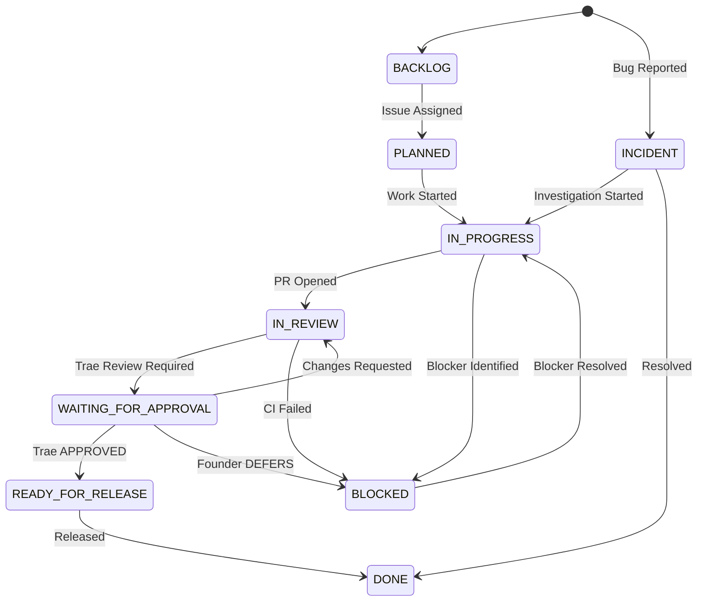
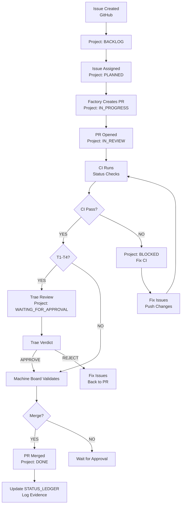
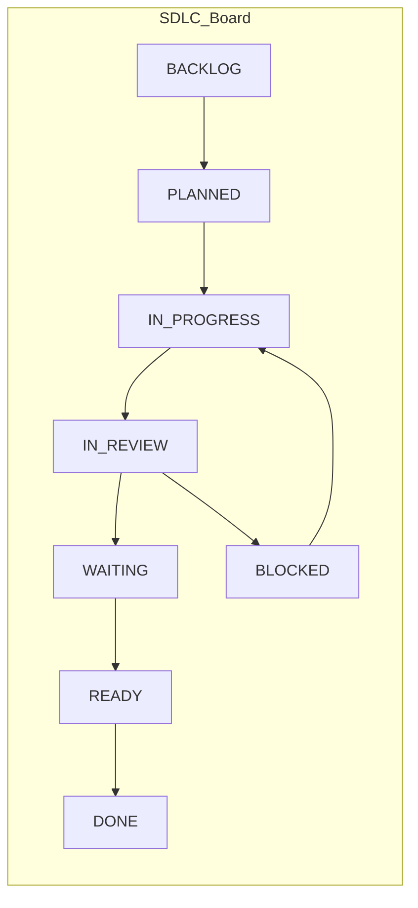
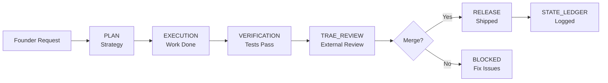

# SDLC — State Machine & Minimum Steps to Ship

Version: v1.0
Owner: Antigravity (CTO)
Ratified By: Founder
Status: CANONICAL

---

## 1. Purpose

This document defines the Software Development Life Cycle (SDLC) of Autonomous Engineering OS. It explains the SDLC board state machine (Issue → PR → CI → Verify → Merge → Ledger), automation rules, and the minimum steps to ship.

**Key Principle**: Every action is provable, reviewed, and resumable.

---

## 2. What is SSOT Here?

The Single Source of Truth for SDLC is:

- **.github/workflows/ci.yml** — Continuous integration workflow
- **.github/workflows/release.yml** — Release workflow
- **.github/workflows/daily-brief.yml** — Daily brief generation
- **scripts/generate_daily_brief.py** — Daily brief script
- **GITHUB_PROJECT_SDLC_ARTIFACT.md** — SDLC board configuration
- **COCKPIT/artifacts/DAILY_BRIEF/** — Daily brief artifacts
- **COCKPIT/artifacts/APPROVALS_QUEUE/** — Approvals queue artifacts

No external systems track SDLC. GitHub Projects serves as the live board.

---

## 3. SDLC State Machine

### 3.1 States



### 3.2 State Definitions

| State | Definition | Entry Criteria | Exit Criteria |
|-------|------------|----------------|---------------|
| **BACKLOG** | Issue created, not assigned | Issue created | Issue assigned |
| **PLANNED** | Issue assigned, not started | Issue assigned | Work begins |
| **IN_PROGRESS** | Active development in progress | PR opened or work begun | PR opened or blocked |
| **IN_REVIEW** | PR open, under review | PR opened | CI passes, Trae review done |
| **WAITING_FOR_APPROVAL** | Trae review/approval needed | CI passes | Trae approves |
| **READY_FOR_RELEASE** | Approved, ready to ship | Trae approved | Released |
| **DONE** | Completed, shipped | Released | — |
| **BLOCKED** | Stopped by blocker | CI fails or blocker identified | Blocker resolved |
| **INCIDENT** | Bug or failure reported | Bug reported | Resolved |

---

## 4. Issue → PR → CI → Verify → Merge → Ledger

### 4.1 End-to-End Flow



---

## 5. Minimum Steps to Ship

### 5.1 Standard Flow (T3 — No Trae Review)

1. **Founder requests feature** → Issue created
2. **Product Droid** → Create user stories, PRD
3. **Antigravity** → Create PLAN artifact
4. **Code Droid** → Implement, write tests, create PR
5. **QA Droid** → Run tests, validate quality
6. **Machine Board** → Validate PR (CI, governance)
7. **PR merged** → Project status: DONE
8. **Knowledge Droid** → Update STATE ledger

**Total steps**: 8 | **Time**: Hours | **Human input**: 1 (approval only if required)

### 5.2 Protected Path Flow (T2 — With Trae Review)

1. **Founder requests change** → Issue created
2. **Antigravity** → Create PLAN artifact
3. **Code Droid** → Implement, create PR (touches GOVERNANCE/)
4. **Factory invokes Trae** → T2 risk detected
5. **Trae reviews** → APPROVE verdict
6. **Factory creates TRAE_REVIEW artifact**
7. **Machine Board validates** → OK (artifact present, verdict APPROVE)
8. **PR merged** → Project status: DONE
9. **Knowledge Droid** → Update STATE ledger

**Total steps**: 9 | **Time**: Hours-days | **Human input**: 0 (Trae replaces human approval)

### 5.3 Production Deploy Flow (T1 — With Founder Authorization)

1. **Founder requests production deploy** → Issue created
2. **Antigravity** → Create PLAN artifact
3. **Code Droid** → Prepare release, create PR
4. **Factory invokes Trae** → T1 risk detected
5. **Trae reviews** → APPROVE verdict
6. **Factory creates TRAE_REVIEW artifact**
7. **Machine Board validates** → OK
8. **Branch protection** → Blocks merge (T1 requires explicit auth)
9. **Founder authorizes** → Comment on PR: "Authorize production deploy"
10. **PR merged** → Project status: DONE
11. **DevOps Droid** → Deploy to production
12. **Knowledge Droid** → Update STATE ledger, log deployment

**Total steps**: 12 | **Time**: Hours-days | **Human input**: 2 (authorization, deploy trigger)

---

## 6. Automation Rules

### 6.1 GitHub Projects Automation Rules

| Rule ID | Trigger → Action |
|---------|-----------------|
| **1** | Issue Created → Status: BACKLOG |
| **2** | Issue Assigned → Status: PLANNED |
| **3** | PR Opened + linked to issue → Status: IN_PROGRESS |
| **4** | PR "In Review" + linked → Status: IN_REVIEW |
| **5** | PR "Waiting for Review" + linked → Status: WAITING_FOR_APPROVAL |
| **6** | PR Merged + linked → Status: DONE |
| **7** | CI Failed + linked → Status: BLOCKED |

### 6.2 Daily Brief + Approvals Queue

| Action | Automation | Schedule | Human Input |
|--------|-----------|----------|-------------|
| Daily Brief Generation | GitHub Actions + Python | Daily 09:00 UTC | 0 |
| Approvals Queue Generation | GitHub Actions + Python | Daily 09:00 UTC | 0 |
| Daily Brief Review | Founder | Daily 09:10 UTC | 5-10 minutes |
| Approvals Queue Actions | Founder | Daily 09:15 UTC | YES/NO/DEFER |

### 6.3 CI/CD Automation

| Workflow | Trigger | Jobs | Status |
|----------|---------|------|--------|
| **ci.yml** | Every PR | lint, test-unit, test-integration, security, build, summary | Required |
| **release.yml** | Manual | staging, production | Manual trigger |
| **daily-brief.yml** | Daily 09:00 UTC | generate-brief, create-pr | Auto |

---

## 7. GitHub Projects Board

### 7.1 Board Configuration

**URL**: https://github.com/users/ranjan-expatready/projects/2

**Columns**:
- BACKLOG
- PLANNED
- IN_PROGRESS
- IN_REVIEW
- WAITING_FOR_APPROVAL
- BLOCKED
- READY_FOR_RELEASE
- DONE

### 7.2 Custom Fields

| Field | Type | Values |
|-------|------|--------|
| **Type** | Dropdown | Epic, Feature, Bug, Incident, Tech Debt |
| **Risk Tier** | Dropdown | T0, T1, T2, T3, T4 |
| **Owner** | Dropdown | Product, Code, Reliability, Knowledge, Advisor |
| **Release** | Text | v1.0, v1.1, etc. |

### 7.3 Visualization



---

## 8. SDLC Artifacts

### 8.1 Required Artifacts

| Artifact | Type | When Created | Required For |
|----------|------|--------------|--------------|
| **PLAN** | Strategy | Before work | T2+ PRs |
| **EXECUTION** | Evidence | During work | Always |
| **VERIFICATION** | Quality | After implementation | T2+ PRs |
| **TRAE_REVIEW** | External review | After Trae verdict | T1-T4 PRs |
| **RELEASE** | Deployment | After merge | Production |
| **INCIDENT** | Failure | When incident occurs | T1 failures |

### 8.2 Artifact Flow



---

## 9. What's Automated vs Requires Founder

### 9.1 Fully Automated

| Task | Automation | Trigger |
|------|-----------|---------|
| Issue → PR link | GitHub Projects automation | PR opened |
| PR status update | GitHub Projects automation | PR events |
| CI runs | GitHub Actions | Every PR |
| Daily brief | GitHub Actions + Python | Daily 09:00 UTC |
| Approvals queue | GitHub Actions + Python | Daily 09:00 UTC |
| Machine Board validation | GitHub Actions | Every PR |
| Trae review invocation | Factory detects T1-T4 | PR opened |

### 9.2 Requires Founder Decision

| Decision Type | Context | Action |
|---------------|---------|--------|
| T1 production deployment | Explicit authorization required | Founder approves via PR comment or Approvals Queue |
| Strategy changes | Major pivot | Direct conversation with Founder |
| Budget approval | Cost threshold exceeded | Approvals Queue |
| Emergency override | Trae unavailable + critical fix | Comment on PR |

### 9.3 Founder Daily Workflow (5-10 minutes)

1. **Review Daily Brief** (COCKPIT/artifacts/DAILY_BRIEF/)
   - Open PRs
   - Blocked items
   - CI status
   - Issues status

2. **Review Approvals Queue** (COCKPIT/artifacts/APPROVALS_QUEUE/)
   - Trae review requirements
   - Waiting for approval items
   - Blocked items

3. **Make Explicit Decisions** (YES/NO/DEFER)
   - Approve production deployments (T1)
   - Approve budget increases
   - Defer items to later

**Total time**: 5-10 minutes | **Frequency**: Daily | **Manual GitHub navigation**: None required

---

## 10. How to Verify

```bash
# Check SDLC board
curl https://api.github.com/graphql -H "Authorization: Bearer GITHUB_TOKEN" \
  -d '{query:"view project 2"}'

# Check daily brief artifacts
ls COCKPIT/artifacts/DAILY_BRIEF/

# Check CI workflows
ls .github/workflows/

# Check daily brief script
cat scripts/generate_daily_brief.py
```

**Verification Links**:
- https://github.com/users/ranjan-expatready/projects/2 — SDLC Board
- GITHUB_PROJECT_SDLC_ARTIFACT.md — Board configuration
- scripts/generate_daily_brief.py — Daily brief generation
- .github/workflows/daily-brief.yml — Daily brief workflow

---

## 11. Common Failures

### 11.1 CI Fails

**Symptom**: PR blocked, Machine Board fails

**Fix**: Fix test/lint errors, push changes

### 11.2 Missing Artifact

**Symptom**: T2+ PR blocked, Trae review required

**Fix**: Factory creates TRAE_REVIEW artifact

### 11.3 Stale Review

**Symptom**: Trae review older than 7 days

**Fix**: Re-request Trae review

### 11.4 Manual GitHub Navigation

**Symptom**: Founder spending time navigating GitHub

**Fix**: Use Daily Brief + Approvals Queue artifacts (5-10 min)

---

## 12. Minimum Viable SDLC

To operate the SDLC with minimal effort:

1. **Daily Brief**: Review 5-10 minutes
2. **Approvals Queue**: Make decisions (YES/NO/DEFER)
3. **System operates** autonomously when decisions=0

No manual GitHub navigation required.

---

## Version History

- v1.0 (2026-01-26): Initial SDLC document

---

**Document Version**: v1.0
**Last Updated**: 2026-01-26
**Status**: CANONICAL
