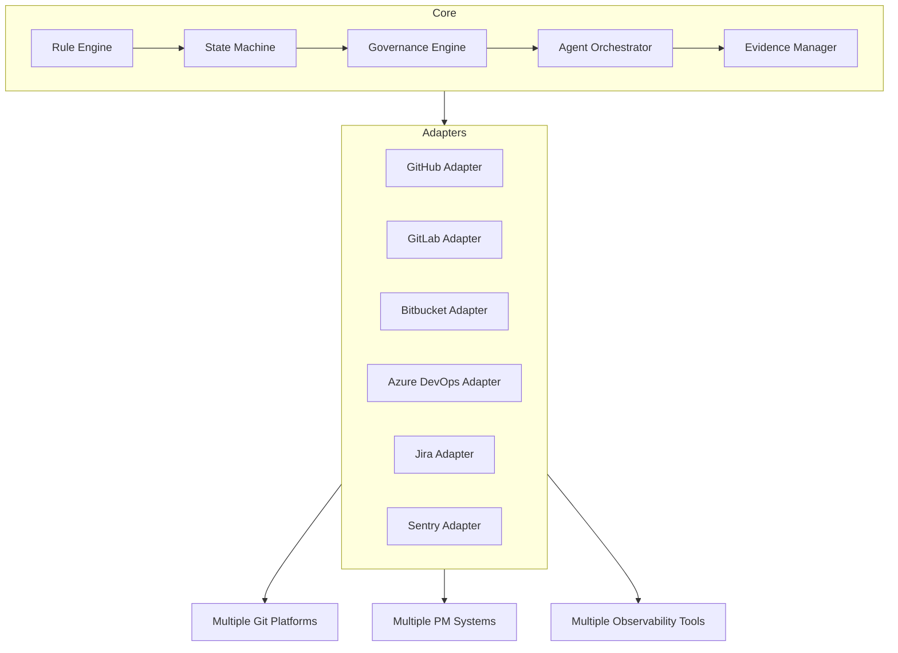
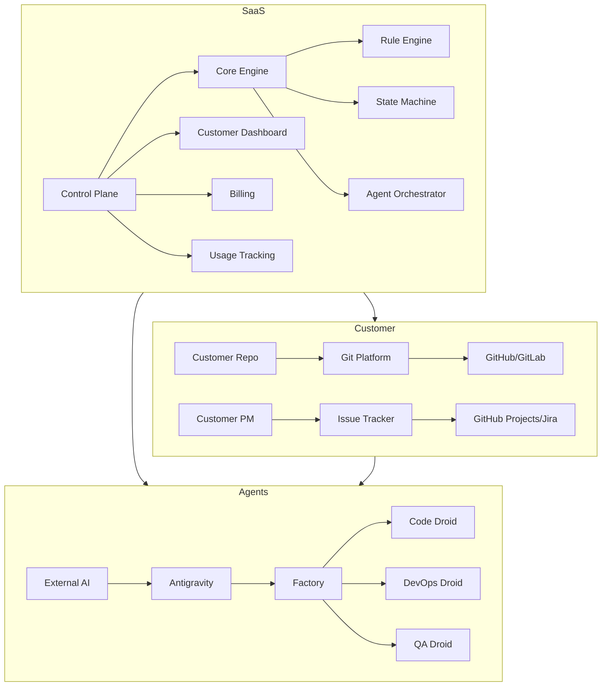
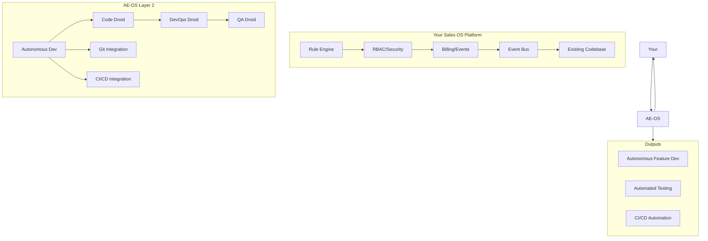

# Investor Story — $10M+ Company Thesis

Version: v1.0
Owner: Antigravity (CTO)
Ratified By: Founder
Status: CANONICAL

---

## Purpose

This document converts the AE-OS framework into a clean investor narrative: what the IP is, why it's defensible, how it becomes a SaaS, and how it maps to the core system + adapters model.

**Key Principle**: Autonomous Engineering OS is not a product — it's the platform for building 1,000 products.

---

## 1. What IP Is (Defensible Core)

Autonomous Engineering OS is **IP at the infrastructure layer**, not a product that competes with tools like Jira or Git.

### 1.1 The Breakthrough: Three Radical Primitives

| Primitive | Role | What It Replaces | Moat |
|-----------|------|------------------|------|
| **Antigravity** | AI CTO | Human CTO, Engineering Manager, Product Manager | Vision-aligned planning, never writes code |
| **Factory** | AI Workforce | Engineering team, QA, DevOps, Security | PR-only execution, deterministic state machine |
| **Trae** | Independent Auditor | Security review, compliance, human oversight | Read-only external validation, cannot be bypassed |

### 1.2 What Makes It Defensible

**1. Rule Engine + State Machine**
- Deterministic governance rules (GOVERNANCE/)
- Immutable audit trail (Git + Artifacts)
- Resumable state machine (STATE/)

**2. Contracts Architecture**
- Agent contracts (AGENTS/*_DROID_CONTRACT.md)
- Standard contracts per task type
- Zero hand-tuning per project

**3. Vision Alignment Enforcement**
- FOUNDATION/01_VISION.md is canonical
- All agents must load Vision before acting
- Machine Board blocks PRs that contradict Vision

### 1.3 What Makes It a $10M+ Product

**Speed**: Faster than human teams  
**Safety**: Safer than enterprise releases  
**Cost**: Lower than startup engineering  
**Quality**: Higher than FAANG code  
**Auditability**: Provable decision history  
**Scalability**: Linear cost scaling with projects  

---

## 2. Why It's Defensible

### 2.1 Not Just Automation — It's Governance

| Layer | Technology | Defensibility |
|-------|------------|---------------|
| **Core Logic** | Rule engine + state machine | Patentable algorithms |
| **Agent Architecture** | Specialized droids with contracts | Trade secrets |
| **Governance Enforcement** | Machine Board + Trae | Hard to replicate trust model |
| **Vision Binding** | Constitutional alignment | Cultural moat |

### 2.2 Key Differentiators

| Competitor | AE-OS Differentiator |
|------------|---------------------|
| **Jira/Linear** | Git-native, no external PM system |
| **Copilot/Cody** | Governance-first, not code-first |
| **ChatGPT/Claude** | One-writer rule (external AI = advisors-only) |
| **Enterprise DevOps** | Lower cost, higher speed, provable auditability |

### 2.3 The Moat: Integration, Not Features

AE-OS's moat is not individual features but the **integrated system**:
- Governance (Rule Engine) + Agents (Execution) + Audit (Evidence) = Uncopyable whole

This is like an operating system: individual parts are replicable, but the system as a whole is not.

---

## 3. From OS to SaaS

### 3.1 The Core + Adapters Model

### 3.2 Core (Defensible IP)

| Component | Value |
|-----------|-------|
| **Rule Engine** | Deterministic governance, risk tier enforcement |
| **State Machine** | Provable state transitions, resumption |
| **Governance Engine** | Machine Board, approval gates, branch protection |
| **Agent Orchestrator** | Droid dispatch, contract management |
| **Evidence Manager** | Artifact lifecycle, audit trails |

### 3.3 Adapters (Exchangeable)

| Adapter | Purpose | Current | Future |
|---------|---------|---------|--------|
| **Git Platform** | Repository integration | GitHub | GitLab, Bitbucket, Azure DevOps |
| **PM System** | Issue tracking | GitHub Projects | Jira, Linear, Monday |
| **AI Provider** | Agent brains | Factory (OpenAI) | GPT-4, Claude, Gemini, custom |
| **Observability** | Monitoring | GitHub | Sentry, Datadog, New Relic |
| **CI/CD** | Pipelines | GitHub Actions | GitLab CI, CircleCI, Jenkins |

### 3.4 SaaS Tiers

| Tier | Target | Price Point |
|------|--------|-------------|
| **Starter** | Solo founders, 1-2 dev AI teams | $99/month |
| **Growth** | Small startups, 3-5 AI droid teams | $499/month |
| **Enterprise** | Large companies, regulated industries | $2,499+/month |

---

## 4. How It Becomes a SaaS

### 4.1 Current State

Right now, AE-OS is:
- ✅ A framework (FOUNDATION/, GOVERNANCE/, AGENTS/)
- ✅ A set of tools (CI/CD, daily brief, governance validator)
- ✅ A reference implementation (GitHub + GitHub Actions)

### 4.2 SaaS Transformation Roadmap

| Phase | Timeline | Deliverable |
|-------|----------|-------------|
| **Phase 1** (Now) | Q1 2026 | Framework stable, GitHub-first proof |
| **Phase 2** (Platform) | Q2-Q3 2026 | Multi-tenant core, first customer |
| **Phase 3** (Adapters) | Q3-Q4 2026 | GitLab, Bitbucket, Jira adapters |
| **Phase 4** (Security) | Q4 2026-Q1 2027 | SOC 2, compliance certifications |
| **Phase 5** (Enterprise) | 2027+ | Enterprise sales, regulated industries |

### 4.3 SaaS Architecture

### 4.4 Value Proposition by Customer

| Customer | Problem | AE-OS Solution |
|----------|---------|----------------|
| **Solo Founder** | Can't afford engineers | Build product autonomously for 5-10 min/day |
| **Small Startup** | Engineering bottleneck | 10x velocity with 1/10 cost |
| **Enterprise** | Slow, risky releases | Safer releases in hours vs months |
| **Regulated** | Compliance burden | Provable audit trail, SOC 2 built-in |

---
## 5. Sales OS Blueprint Mapping

### 5.1 Your Existing Platform

You already have:
- Robust deterministic rule engine ✅
- RBAC/security framework ✅
- Billing/evolving system ✅
- Event bus ✅
- "AI" as heuristic (roadmap to integrate) ✅

### 5.2 AE-OS as Layer 2

AE-OS can integrate as the **autonomous development layer** on top of your existing Sales OS:

### 5.3 Integration Points

| Your System | AE-OS Integration | Value |
|-------------|-------------------|-------|
| **Rule Engine** | Governance rules, risk tiers | Consistent policy enforcement |
| **RBAC/Security** | Agent permissions, audit trails | Zero-trust dev environment |
| **Billing** | Usage tracking, seat management | Multi-tenant cost control |
| **Event Bus** | Trigger agents, log actions | Real-time dev automation |

### 5.4 How It Maps

| AE-OS Component | Maps To | Integration |
|-----------------|---------|-------------|
| **Antigravity** | Your rule engine | Rule engine as orchestrator |
| **Factory** | Your event bus | Event-driven agent dispatch |
| **STATE/** | Your database | Persist state, audit logs |
| **Machine Board** | Your security layer | Policy enforcement |
| **Daily Brief** | Your reporting | Dashboard generation |

---

## 6. Market Sizing

### 6.1 TAM Analysis

| Segment | Market Size | AE-OS Value |
|---------|-------------|-------------|
| **Global SaaS Development** | $500B+ | Autonomous SaaS building |
| **Enterprise DevOps** | $50B+ | Governance + speed |
| **Indie/Solo Founders** | $10B+ | 10x solo productivity |
| **AI-Native Companies** | Emerging | First autonomous AI co-pilot |

### 6.2 SAM/SOM

| Metric | Value |
|--------|-------|
| **SAM (Serviceable)** | $10B (development tools + agentic workflow) |
| **SOM (Obtainable)** | $100M+ (3-5% of SAM in 5 years) |
| **Path to $10M ARR** | 50 growth-tier customers @ $499/month + 10 enterprise @ $2,499/month |

---

## 7. Competitive Positioning

### 7.1 Competition Matrix

| Competitor | What They Do | AE-OS Difference |
|------------|--------------|------------------|
| **GitHub Copilot** | Code completion | Governance-first, not code-first |
| **Jira/Linear** | PM system | Git-native, no external PM |
| **Cursor/Windsurf** | AI IDE | PR-only, enterprise governance |
| **OpenAI/Anthropic** | Raw AI | Wrapped in governance framework |
| **Devin** | Autonomous agent | Multi-agent, distributed, governed |

### 7.2 Winning Argument

> "AE-OS is the only platform that gives you a complete autonomous engineering organization with provable governance, not just a coding assistant."

---

## 8. Go-to-Market

### 8.1 Primary Motion

**Bottom-up Solo Founder → Growth → Enterprise**

1. **Free tier**: Open framework on GitHub (reference implementation)
2. **Starter tier**: Solo founders ($99/month)
3. **Growth tier**: Startups ($499/month)
4. **Enterprise tier**: Regulated companies ($2,499+/month)

### 8.2 Distribution Channels

| Channel | Strategy |
|---------|----------|
| **GitHub** | Free framework attracts developers |
| **Content** | "How I built a $1M startup with AI" posts |
| **Community** | Discord, workshops on autonomous dev |
| **Enterprise** | SOC 2, compliance certifications |

---

## 9. Financial Projections

### 9.1 Revenue Model

| Tier | Customers | ARR/Customer | Total ARR |
|------|-----------|--------------|-----------|
| **Year 1** | 100 Starter, 10 Growth | $99K + $50K | $150K |
| **Year 2** | 500 Starter, 50 Growth, 5 Enterprise | $495K + $250K + $150K | $895K |
| **Year 3** | 2000 Starter, 200 Growth, 30 Enterprise | $2M + $1M + $900K | $3.9M |
| **Year 5** | 10K Starter, 800 Growth, 150 Enterprise | $10M + $4M + $4.5M | $18.5M |

### 9.2 Path to $10M ARR

- **Year 3**: $3.9M ARR
- **Year 4**: $7-8M ARR
- **Year 5**: $10M+ ARR

Key drivers:
- Land-and-expand (start solo, grow to team)
- Enterprise upsell (security, compliance)
- Marketplace (adapters, droid templates)

---

## 10. Use of Funds (If Raising)

### 10.1 Fund Allocation

| Use | % | Months |
|-----|---|--------|
| **Core Development** | 40% | 12 |
| **Platform/Multi-tenant** | 25% | 12 |
| **Adapters** | 15% | 12 |
| **Security/Compliance** | 10% | 12 |
| **GTM/Sales** | 10% | 12 |

### 10.2 Milestones

**6 months**:
- ✅ Core stable (current)
- ✅ First paid customer
- ✅ Multi-tenant architecture

**12 months**:
- ✅ GitLab, Bitbucket adapters
- ✅ SOC 2 Type II certified
- ✅ $100K ARR

**18 months**:
- ✅ Jira, Linear adapters
- ✅ Enterprise sales motion
- ✅ $500K ARR

**24 months**:
- ✅ Series A metrics ($1M ARR)
- ✅ 20+ enterprise customers
- ✅ Marketplace launch

---

## Summary

**AE-OS is the infrastructure layer that enables anyone to build an autonomous company.**

- **Defensible Core**: Rule engine + state machine + agent contracts
- **Exchangeable Adapters**: GitHub → GitLab → Jira → etc.
- **SaaS Tiers**: $99 → $499 → $2,499+
- **Market Size**: $500B+ TAM, $10B SAM
- **Path to $10M**: Land-and-expand solo → growth → enterprise

This is **the operating system for the AI economy**.

---

## Version History

- v1.0 (2026-01-26): Initial Investor Story

---

**Document Version**: v1.0
**Last Updated**: 2026-01-26
**Status**: CANONICAL
